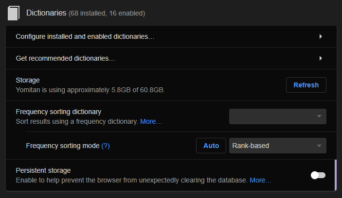
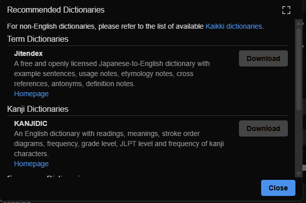
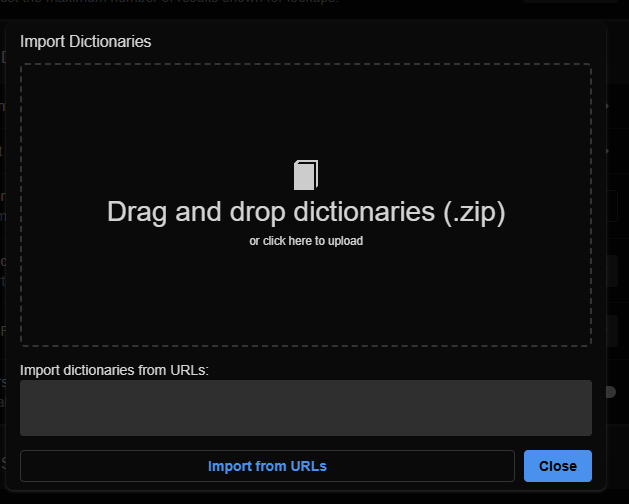

import React from 'react';

# Japanese Setup 

## Anki

### Apa Itu Anki

### Install Anki 

[Download Anki](https://apps.ankiweb.net/)
1. Download Anki
2. Download Add-ons
3. Download Pre-built Deck
4. Download Mining Deck

### Setting 

### Install Font 

### Add-ons

### FSRS 

### Prebuilt Deck 
1. [Kaishi 1.5K Indonesia](https://ankiweb.net/shared/info/1512066033)
2. [Kaishi 1.5K English](https://ankiweb.net/shared/info/1196762551)
3. [Kanji Kentei Part 1](https://ankiweb.net/shared/info/759825185)
4. [Kanji Kentei Part 2](https://ankiweb.net/shared/info/1113953752)

### Mining Deck
1. [Lapis](https://github.com/donkuri/lapis)
2. [JP Mining Note](https://arbyste.github.io/jp-mining-note-prerelease/)
3. [JP Study](https://github.com/rudnam/JP-study)
4. [Crop Theft](https://github.com/Kuuuube/crop-theft)

- Miscellaneous
  - **[Anki Templates](https://chrisk91.me/post/2018-09-28-Anki-Templates-Introduction-HTML/)** - A handy guide explaining Anki card formatting.

## Yomitan

### Apa itu Yomitan
Yomitan adalah sebuah pop up dictionary yang bisa mencari arti dan bacaan dari sebuah kata bahasa Jepang di browser dengan cepat dan mudah. 

:::note

Yomitan juga mendukung bahasa lainnya seperti Bahasa Korea, Mandarin, Inggris dan berbagai macam bahasa lainnya.

:::

### Kenapa harus pakai Yomitan

Yomitan adalah salah satu alat paling penting dan krusial dalam bahasa Jepang. Dengan menggunakan Yomitan kalian bisa mencari cara baca, arti, frequensi, dan pitch accent dari sebuah kosakata hanya dengan satu kali klik saja. Hal ini berarti menggunakan Yomitan sama dengan menghemat ribuan jam yang bisa kalian pakai untuk belajar bahasa Jepang lebih efektif tanpa menghabiskan waktu kalian untuk mencari arti dan bacaan sebuah kata di aplikasi kamus bahasa Jepang-Inggris, lebih parahnya lagi kalau kalian menggunakan kamus yang berbentuk buku fisik, itu adalah hal paling buruk yang bisa kalian lakukan dalam bahasa Jepang. 

Mari kuperlihatkan seberapa pentingnya Yomitan ini. 

Lihatlah kata ini

薔薇

#### Kekurangan Kamus Fisik

Kalau kalian punya kamus fisik bahasa Jepang, coba kalian cari arti dari kata tersebut. 

Aku yakin kalian pasti akan langsung menyerah.

Bagaimana mungkin aku mencari arti dari sebuah kata yang bahkan aku tidak tahu cara bacanya??

Aku bahkan tidak tahu cara menulis kanji tersebut.

Apa aku harus membuka semua halaman satu persatu sampai ketemu kata tersebut?

Kalaupun kamusnya diurutkan dari huruf A-Z, aku harus cari di bagian yang mana ketika aku tidak tahu cara baca kata tersebut? 

Yah, intinya menggunakan kamus fisik bagi orang yang baru belajar bahasa Jepang sangat tidak disarankan, dan kalaupun kalian sudah mahir berbahasa Jepang, menggunakan kamus fisik juga lebih baik dihindari karena akan sangat membuang-buang waktu kalian. 

----
#### Kekurangan Kamus Aplikasi 

Sekarang mari kita bahas kasus lainnya dengan kamus aplikasi yang ada di smartphone ataupun website. 

Setidaknya menggunakan kamus elektronik seperti ini jauh lebih efektif jika dibandingkan dengan kamus fisik karena meskipun kalian tidak tahu cara baca dari kata tersebut, setidaknya kalian masih bisa memilih teksnya untuk di copy dan di paste ke kolom pencarian yang ada di aplikasi kamus kalian.

Tapi.... 

Tapi kalian sadar nggak, kalau proses copy-paste ini juga masih memakan waktu yang cukup banyak, selain itu kalian juga harus sering berganti-ganti hanya untuk membuka aplikasi kamus kalian. 

Kalau hanya mencari satu atau dua kata saja maka tidak akan ada masalah. Tapi di perjalanan bahasa Jepang kalian nanti, kalian akan mencari ribuan hingga puluh ribuan kosakata tergantung konten yang akan kalian konsumsi nantinya.

Ini hanya hiperbola, tapi aku yakin jari kalian akan putus jika kalian mencari ribuan kosakata hanya dengan memakai cara copy paste. 

----

#### Yomitan Menjadi Solusi

Yomitan disini menjadi solusi dari masalah tersebut. Seperti yang sudah aku katakan sebelumnya Yomitan bisa membantu kalian mencari informasi dari sebuah kata hanya dengan satu kali klik dalam waktu yang sangat sangat singkat. 

Ini adalah contoh penggunaan Yomitan. Kalian bisa lihat hanya dengan mengarahkan kursor ke sebuah kata, kita bisa mendapatkan berbagai informasi seperti bacaan, arti pitch accent, frekuensi, dan bahkan contoh kalimat yang menggunakan kata tersebut hanya dalam hitungan detik saja.

<video width="560" height="315" controls>
  <source src={require('@site/static/videos/bara.mp4').default} type="video/mp4" />
  Your browser does not support the video tag.
</video>

Bagaimana? Sangat praktis bukan? 

Pop Up Dictionary seperti Yomitan ini adalah penyelamat dan juga teman yang akan selalu menemani perjalan kalian dalam mempelajari bahasa Jepang. 

----

### Download dan Install

Yomitan bisa digunakan di Google Chrome dan Juga Firefox. 

[Chrome Web Store](https://chromewebstore.google.com/detail/yomitan-popup-dictionary/likgccmbimhjbgkjambclfkhldnlhbnn)
[Firefox](https://addons.mozilla.org/en-GB/firefox/addon/yomitan/)

Untuk informasi lebih detail tentang Yomitan, kalian bisa mengunjungi langsung website resminya.

[Yomitan](https://yomitan.wiki/)

### Download Kamus

Yomitan pada dasarnya hanyalah sebuah ekstensi pop up dictionary. Jadi sebelum kalian bisa menggunakannya, kalian perlu mendownload kamus dan mengimportnya ke dalam Yomitan. Untungnya di dalam Yomitan sendiri sudah ada kamus Jitendex (Kamus Jepang-Inggris) yang bisa kalian download secara langsung. 

Kalau kalian membutuhkan kamus lainnya seperti kamus Korea, Mandarin, atau Cantonese, kalian bisa langsung cek di website resmi [Yomitan](https://yomitan.wiki/dictionaries/).

Selain kamus-kamus yang ada di website resmi Yomitan, masih ada banyak lagi kamus-kamus lain yang dibuat oleh pihak ketiga. Ada beberapa jenis kamus yang bisa kamu install di Yomitan. 

- Kamus Bilingual - Kamus dua bahasa. Contoh : Kamus Jitendex (Jepang-Inggris)
- Kamus Monolingual - Kamus satu bahasa. Contoh : Kamus Digital Daijisen (Jepang-Jepang)
- Kamus Kanji - Kamus yang berisi tentang info kanji secara detail mulai dari bacaan, arti, radikal, level kanji kentei dan lain-lain.
- Kamus Pitch Accent - Kamus yang berisi tentang info pitch accent dari sebuah kata.
- Kamus Frekuensi - Kamus yang berisi tentang frekuensi atau seberapa sering sebuah kata digunakan. 
- Kamus Grammar - Kamus yang berisi tentang penjelasan berbagai grammar point.
- Kamus lain-lain - Kamus-kamus yang tidak masuk ke dalam enam kategori di atas. 

Di dalam Yomitan kalian sudah diberikan beberapa pilihan kamus seperti 
- Kamus Jitendex (Kamus Bilingual)
- KANJIDIC (Kamus Kanji)
- JPDB (Kamus Frekuensi)

Sebenarnya untuk awalan, ketiga kamus itu sudah cukup, tapi tidak ada salahnya kalau kalian ingin mencari kamus lainnya.

### Menginstall Kamus

#### Menginstall Kamus Bawaan Yomitan

1. Klik ikon  di toolbar browser.
2. Klik tombol setting 
3. Cari menu *Dictionaries* dan pilih *Get recommended dictionaries*

4. Lalu download semua dictionary yang sudah disediakan

#### Menginstall Kamus Pihak Ketiga 

1. Klik ikon  di toolbar browser.
2. Klik tombol setting 
3. Cari menu *Dictionaries* dan pilih *Configure installed and enabled dictionaries*

4. Klik import dan cari kamus yang sudah kamu download.

### Setting Mining Deck

- [Yomitan](https://yomitan.wiki/) - A pop-up dictionary browser extension that lets you analyze words and grammar on the fly.
  - **[Yomitan setup guide](https://donkuri.github.io/learn-japanese/setup/#yomitan-setup)** - A guide explaining how to setup Yomitan as well as what it is. Written by [kuri](https://github.com/donkuri/).
  - [Xelieu's Yomitan setup](https://xelieu.github.io/jp-lazy-guide/setupYomitanOnPC/) - Another setup guide for Yomitan. Written by [Xelieu](https://github.com/xelieu).
  - [Xelieu's Yomitan on Android setup](https://xelieu.github.io/jp-lazy-guide/setupYomitanOnAndroid/) - A setup guide for Yomitan on Android devices. Written by [Xelieu](https://github.com/xelieu).
  - [Marv's dictionary collection](https://github.com/MarvNC/yomitan-dictionaries) - A collection of Yomitan dictionaries hosted by [MarvNC](https://github.com/MarvNC).

## References 
[The Moe Way](https://learnjapanese.moe/yomichan/)